### High Resolution Land Cover Mapping using Deep learning

An overview of applying deep learning models to provide high resolution land cover in the state of Alabama using Keras and ArcGIS

I also published this work on Medium below.

https://medium.com/geoai/high-resolution-land-cover-mapping-using-deep-learning-7126fee571dd

Outline:

1. Land Cover Mapping 
2. Image Segmentation
3. Data Sources
4. Data Preparation using ArcGIS Pro and ArcGIS API for Python
5. Data Augmentation
6. Modify and Train U-Net Model
7. Deploy Model in ArcGIS Pro and Run The Trained Model on NAIP Images
8. Accuracy Assessment
9. GeoAI Cookiecutter Data Science Template
10. Conclusion
11. Acknowledgement and References

### 1. Land Cover Mapping 
Global land cover maps have been extensively used for a variety of applications including ecosystem services, climate change, hydrological processes, and policy making at local and regional scales. While low resolution, spatial (e.g., 30m) and temporal (e.g., every 5 years), land cover maps have been developed by various agencies (e.g., USGS, USDA, NASA) for the entire Europe and USA, creation of real-time high resolution spatial and temporal land cover maps (e.g., 1 meter) at regional scale is lacking. The land change science community has been pursuing this goal since early 2000s without broad success.

In this blog article, I will walk you through the model we developed that can create a classified land cover map with 1 meter resolution from National Agriculture Imagery Program (NAIP) image at pixel level (Figure 1). The trained model classifies NAIP image to six land cover classes: 1) buildings, 2) roads or parking lots, 3) water, 4) harvested, open land or bare land, 5) forest and 6) planted or dark cropland.

NAIP Image                   |  Classified NAIP Image
:---------------------------:|:--------------------------------:
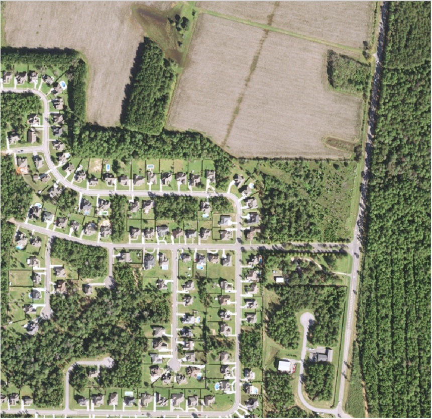  |  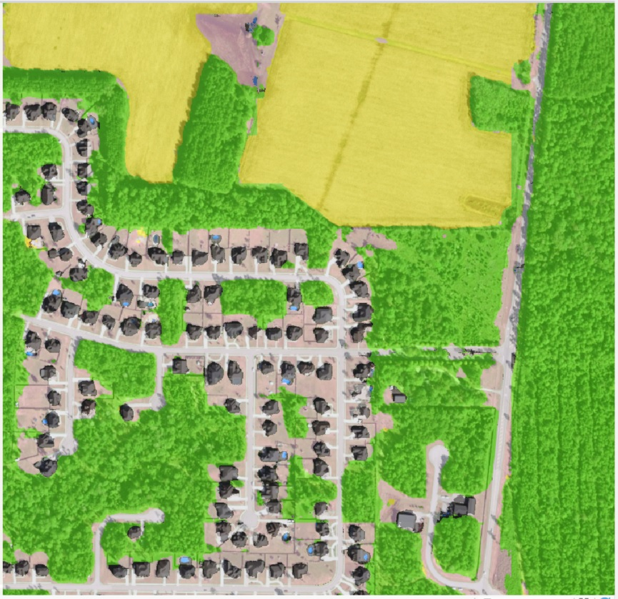

Figure 1. Raw NAIP Image versus Classified Image

Beside land cover classification approaches that you might be able to find in other blogs, I am also interested to show here that how you can leverage ArcGIS API for Python and ArcGIS Pro and integrate them with deep learning tools (e.g., Keras here). This enables you to prepare geospatial data (raster or vector data) faster by leveraging Geoprocessing Tools in ArcGIS Pro that can be used in Python and visualize progress in ArcGIS Pro (Figure 2).

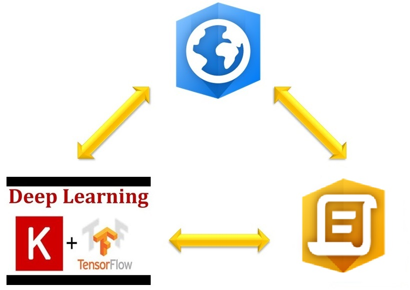

Figure 2. Integrating ArcGIS Pro, Python API and Deep Learning

### 2. Image Segmentation
Image segmentation is one of the critical problems in the field of computer vision. Image segmentation is dividing an image to multiple segments. In another words, image segmentation is the process of assigning a label to every pixel in an image such that pixels with the same label share certain characteristics. Image segmentation is an ideal approach to be used for land cover classification since within each land cover class pixels share similar characteristics across multiple bands. The importance of image segmentation has been illustrated in various applications such as self-driving vehicles, human-computer interaction, virtual reality etc. With the popularity of deep learning, many image segmentation problems are being tackled using deep architectures which surpass other traditional machine learning approaches by a large margin in terms of accuracy.

### 3. Data Sources
Our study area was part of Alabama State. we collected 12 NAIP images [Ref 1], 8 NAIP images in the north and 4 NAIP images in the south, using ArcGIS Online [Ref 2]. NAIP imagery is acquired at a one-meter ground sample distance with a horizontal accuracy. The spectral resolution of NAIP has four bands including natural color (Red, Green and Blue, or RGB) and Near Infrared.

First, I used the Create Mosaic Dataset function in ArcGIS Pro [Ref 3] to create an empty mosaic dataset in a geodatabase. Second, I used the Add Rasters To Mosaic Dataset function in ArcGIS Pro [Ref 4] to add NAIP images to an empty mosaic dataset. As a result, the Add Rasters To Mosaic Dataset function creates two feature classes called 1) boundary layer that shows the extent of study area, 2) footprint layer that shows the extent of each NAIP image as well as one raster that called Image layer that contains the mosaic of NAIP images (Figure 3).

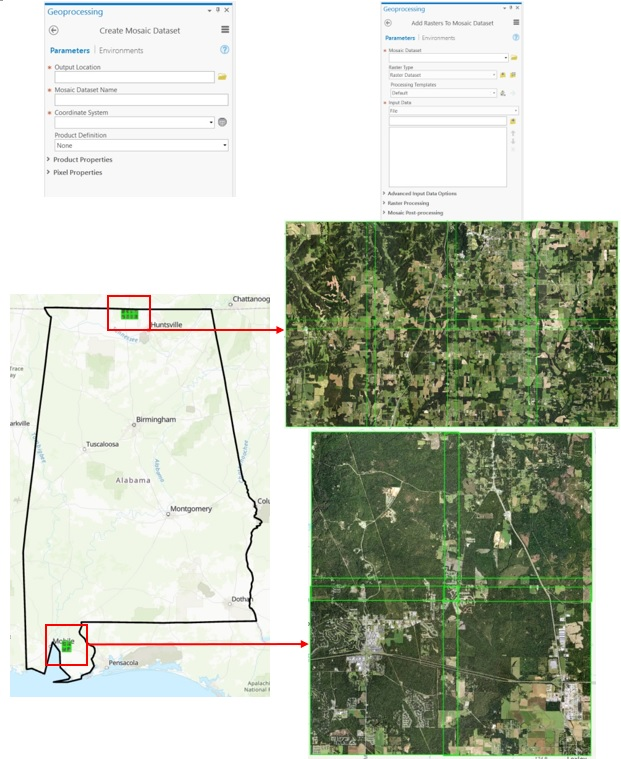

Figure 3. Geoprocessing Tools, NAIP Images and Study Area

### 4. Data Preparation using ArcGIS Pro and ArcGIS API for Python
For training run, I need to have labelled data for each land cover class like other deep learning models. I used Training Samples Manager in ArcGIS Pro [Ref 5] to label six land cover classes on top of NAIP images. The labels collected randomly across study area (Figure 4).

Training Sample Manager                                 |  Land Cover Samples
:------------------------------------------------------:|:-------------------------:
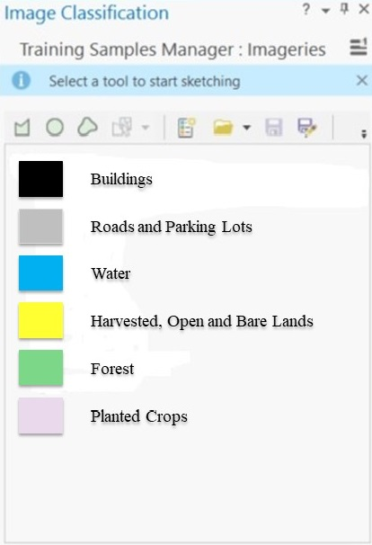  |  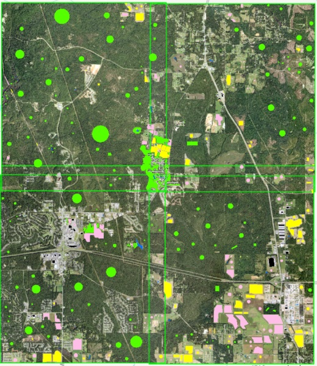

Figure 4. Training Samples Manager and Sampled Labels

The input and output of Image Segmentation model should be in raster format for the training run. Since labelled data are in feature class or vector format, I used Feature to Raster function in ArcGIS Pro [Ref 6] to convert labelled data in feature class format to raster format.

Since it is very time consuming to label an entire NAIP image, I had areas across NAIP images that were not labeled. For areas that I did not have labeled data, ArcGIS Pro assigned No-Data. I used Reclassify function in ArcGIS Pro [Ref 7] to convert No-Data to zero and keep the values of other land classes same. You can think areas with 0 values as background class that won’t have any influence in training run. I will explain later in loss function how I minimized that effect of background class

Since NAIP image has a large footprint (~7.5km × ~6.5km) and they cannot be fed directly to the model, I converted the NAIP images and corresponding labelled data in raster format to smaller images. To achieve this, I used Export Training Data For Deep Learning in ArcGIS Pro [Ref 8] to convert NAIP mosaic raster as input of model and the corresponding raster labelled data to smaller chip. This tool lets you to choose the size of each chip as well as stride in X and Y axes. I chose chip size of 256 and stride size 64 along X and Y axes. This tool only exports chips that have both NAIP and labeled data (Figure 5; Python #1). I defined the format of images and labels in TIFF format. The total number of chips for each NAIP image depends on labeled data across each NAIP image.

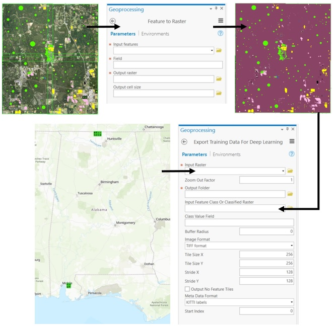

Figure 5. Export Training Data for Deep Learning

If more than 50% of chip had background class (0 value), they are dropped from further analysis. Due to the large volume and number of images in each folder (12 folders correspond to 12 NAIP images), I stacked chips across folders and converted to separate HDF5 format for each land cover class (Python #2). This enabled me to keep track of number of chips for each land cover class.

### 5. Data Augmentation
Deep learning models require lots of data for training. From the training data, I generated 420, 438, 702, 1008, 837, 891 chips for buildings, roads, water, harvested lands, forest and planted lands, respectively. The main solution for lack of training data is to use data augmentation to increase number of training data. I only used HDF5 files for rare land cover classes in data augmentation and made the number of rare classes two or three times more.

I used three common methods of data augmentation to increase number of training data for rare land cover classes (buildings, roads or parking lots, and water): 1) shifting: Export Training Data For Deep Learning in ArcGIS Pro [Ref 8] has stride option (distance to move when creating the next image chip) along X and Y direction. The exported chip were 256 along X and Y direction. I set stride 64 along X and Y direction to get more chips. This happened during Data Processing step and I did not do it again here, 2) rotation: in each run of data augmentation, each chip randomly selects among four values [-180, -90, 90, 180] to create new chip, and 3) zoom: in each run of data augmentation, each chip randomly selects a zoom factor across given range [0.05, 0.45] to create new chip (Figure 6; Python #3). I then merged new generated data with existing often land cover classes (harvested or bare land, forest ,and planted or dark cropland). Finally, I normalized each band of NAIP image and shuffled training samples.

Data Augmentation     | Data Augmentation
:--------------------:|:---------------------:
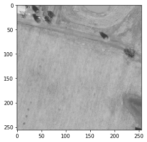  |  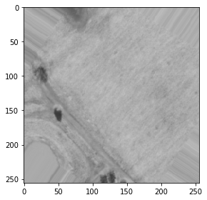
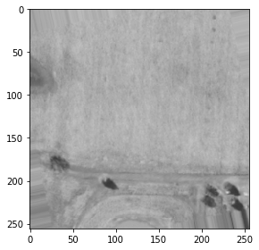  |  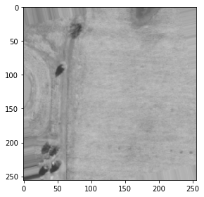

Figure 6. Example of Data Augmentation

### 6. Modify and Train U-Net Model
The U-Net architecture is an encoder-decoder architecture. U-Net, a type of fully conventional network, comprises three parts: 1) A contracting path like an encoder, 2) A symmetric expanding path like a decoder and 3) skip connections (e.g., Residual Neural Network) that passes the feature maps in encoder part to decoder part.

Since I did not have a large dataset, I had to modify U-Net to a new structure with fewer parameters (Figure 7). The new U-Net model has 1,941,351 parameters (Python #3). As discussed, in each chip there are cells with values 0 or background class that it’s not our interest. I had to generate this class because it’s not typically feasible to label all cells in image. To overcome this issue in training run, I had to write a custom loss function that ignores zeros while calculating loss. This customized loss function handles this issue by defining weights for each land cover class. I set weight for background class close to zero. In training run, I used 90% of data for calibration and left out 10% of data for validation. I defined mean of intersection over Union (IoU) to calculate accuracy of model using validation data in training run. I ran model for 30 epochs. Model stopped training in epoch 20 since validation loss did not improve significantly.

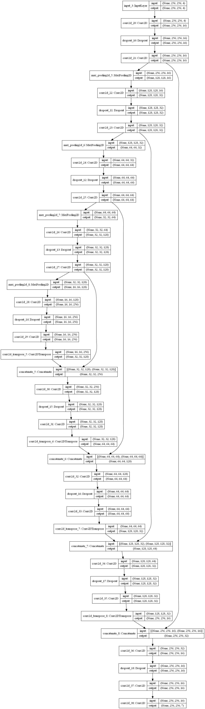

Figure 7. Modified Structure of U-Net

### 7. Deploy Model in ArcGIS Pro and Run The Trained Model on NAIP Images
The U-Net model was saved in HDF5 format. ArcGIS Pro has a pleasant way to deploy models and run them at scale [Ref 8]. I used Python raster functions in ArcGIS Pro to deploy model. Raster functions in ArcGIS Pro use parallel processing to run models faster. ArcGIS Pro has two geoprocessing tools that can run deep learning models: “Detect Objects Using Deep Learning” and “Classify Pixels Using Deep Learning”. I used Classify Pixels option since I am running segmentation model. Integration of external deep learning model frameworks currently works any deep learning framework, provided you can supply a raster function. Out of the box, raster functions are supplied for the TensorFlow Object Detection API, and a few other frameworks. Once the model is trained, you use an Esri Model Definition file (.emd) to run geoprocessing tools to detect or classify features in ArcGIS Pro. You also need to install the proper deep learning framework and supporting Python libraries (TensorFlow, CNTK, PyTorch, or Keras) in the ArcGIS Pro Python environment; otherwise, an error will occur when you add the .emd file to the tool. The .emd file is a JSON file that describes the trained deep learning model. It contains model definition parameters that are required to run the inference tools, and it should be modified by the data scientist that trained the model.

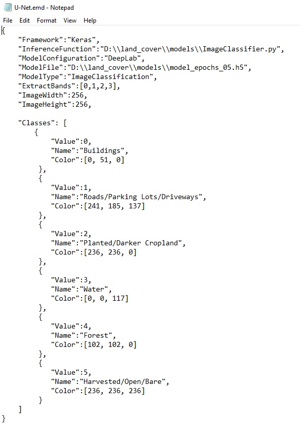

Figure 8. Structure of EMD file for U-Net Model

After creating the .emd file (Figure 8), I ran inference on 12 NAIP images (Figure 9).

NAIP Image                   |  Classified NAIP Image
:---------------------------:|:--------------------------------:
  |  
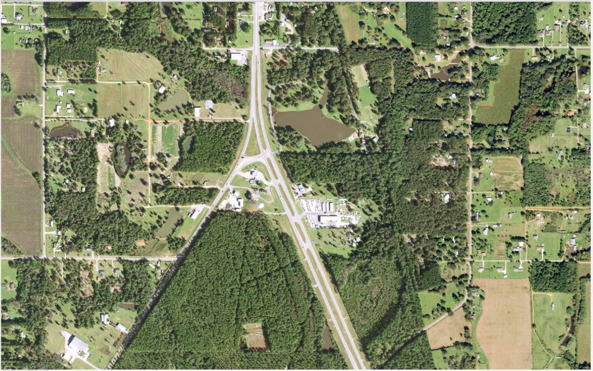  |  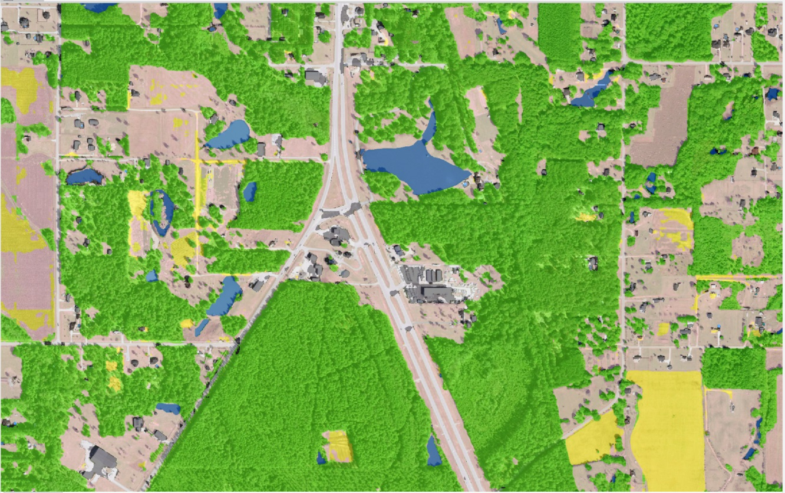
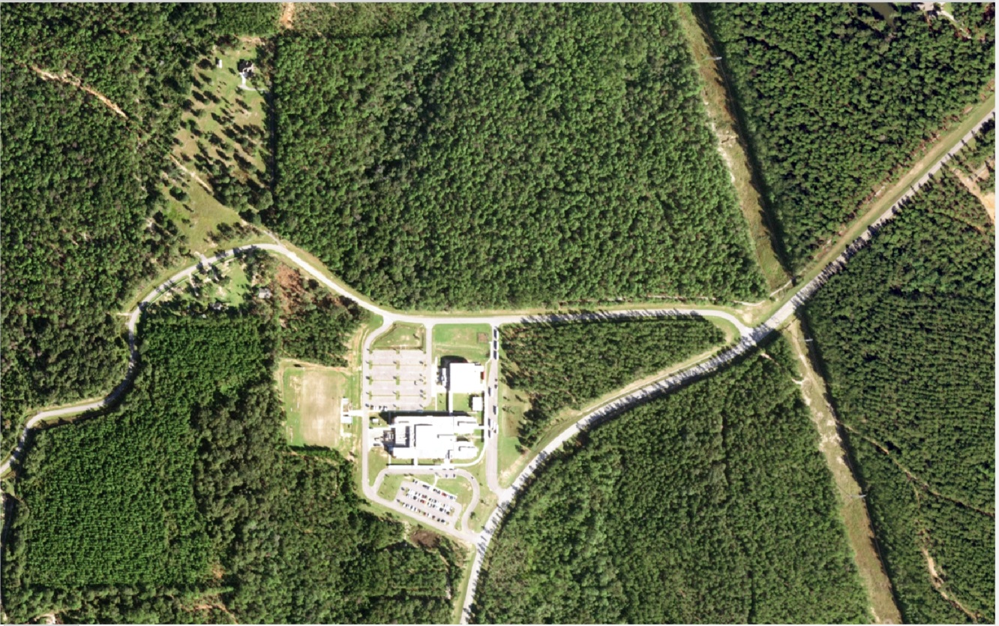  |  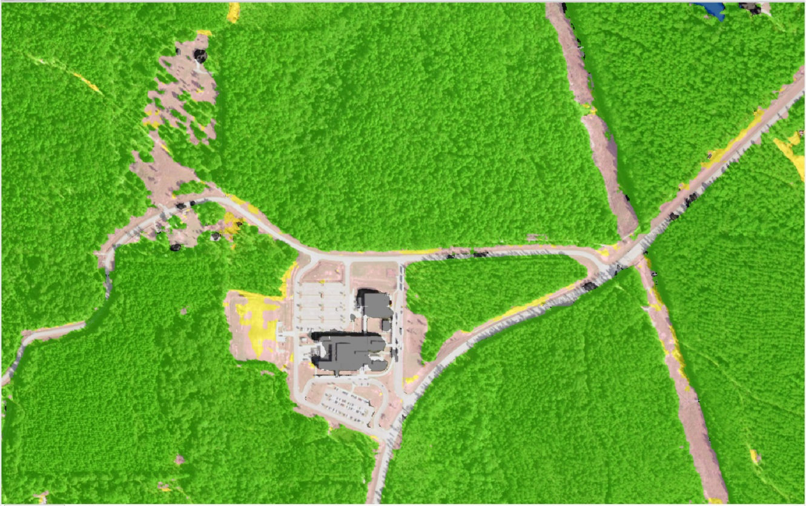
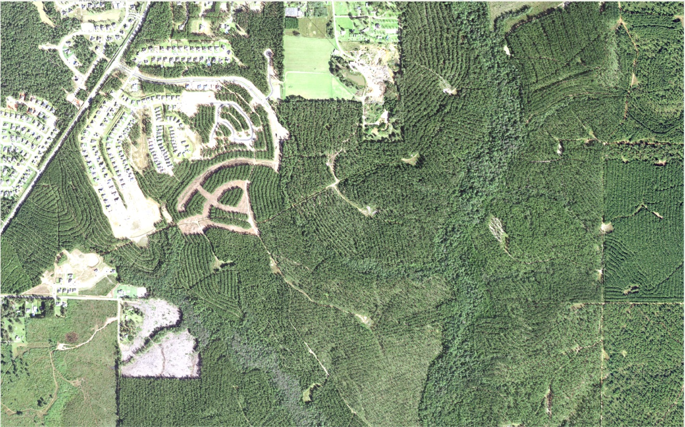  |  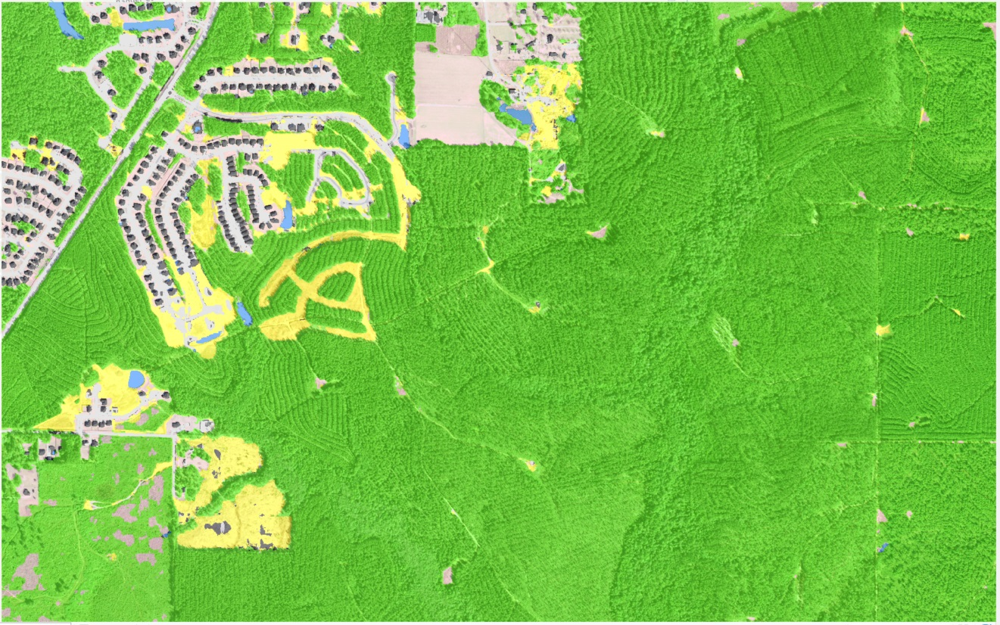
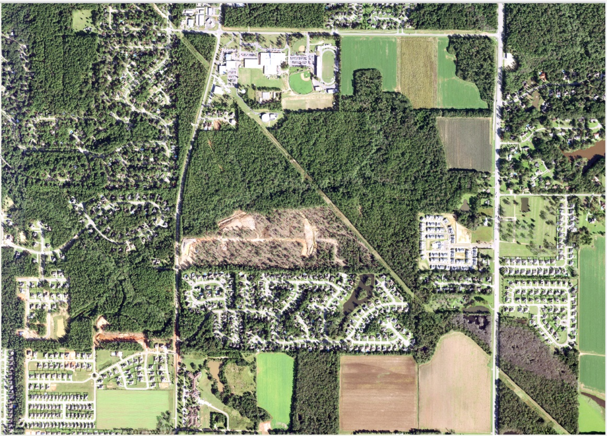  |  

Figure 9. Raw NAIP image and Classified Land Cover Map from U-Net

### 8. Accuracy Assessment
I separated one of the NAIP images that had labels and was not used in training run. I used this NAIP image for the testing run. I ran inference on this image and compared the output of model with the rasterized version of the labelled data. The outcome of this comparison was a contingency table that is usually used in remote sensing for accuracy assessment. I calculated the precision and recall for each land cover class. The overall accuracy of the U-Net model is around 85% for given area. It was not surprising that the model performed better for frequently seen classes compared to rare classes.

| Class      | Precision | Recall |
| :---:      | :---:     | :---:  |
| Buildings  | 86.50     | 85.28  |
| Roads      | 85.34     | 84.15  |
| Waters     | 90.78     | 89.88  |
| Harvested  | 93.33     | 94.57  |
| Planted    | 92.88     | 93.05  |
| Forest     | 95.12     | 94.34  |

Table 1. Accuracy Assessment of U-Net Model (Precision and Recall in %)

### 9. GeoAI Cookiecutter Data Science Template
Sharing a Data Science project with other data scientists is always challenging since everybody has their own structure to build a template for a Data Science project. The common format for a Data Science project enables data scientists to expect specific format when they share or receive project from others. Here, I used Cookiecutter Data Science Template which is a logical, reasonably standardized, but flexible project structure for doing and sharing data science work. You can easily set up the template for your project using few command lines. Our team (the Esri GeoAI team) implemented a new cookiecutter template for Geospatial projects strongly based on the data science cookiecutter template.

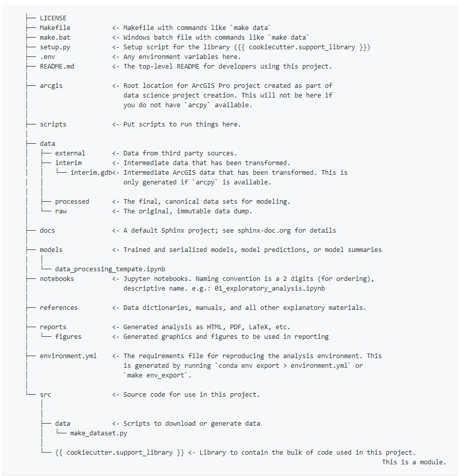

Figure 10. Cookiecutter Data Science Template for GeoAI Team 

### 10. Conclusion
In this article, I walked you through the U-Net model I used to create classified land cover map with 1m resolution from NAIP images at the pixel level. The trained model classifies NAIP images into six land cover classes called 1) buildings, 2) roads or parking lots, 3) water, 4) harvested, open land or bare land, 5) forest and 6) planted or dark cropland. I also showed how you can leverage the ArcGIS API for Python with ArcGIS Pro and integrate them with deep learning tools (e.g., Keras) to facilitate data preparation and modeling. The U-Net model performed well using 4 NAIP bands to classify NAIP images.

### 11. Acknowledgement and References
I want to say thanks to Daniel Wilson and Mary Wahl (Microsoft) who answered my questions during the project.

Ref 1) https://www.fsa.usda.gov/programs-and-services/aerial-photography/imagery-programs/naip-imagery

Ref 2) https://www.arcgis.com/index.html

Ref 3) http://pro.arcgis.com/en/pro-app/tool-reference/data-management/create-mosaic-dataset.htm

Ref 4) http://pro.arcgis.com/en/pro-app/tool-reference/data-management/add-rasters-to-mosaic-dataset.htm

Ref 5) https://pro.arcgis.com/en/pro-app/help/analysis/image-analyst/training-samples-manager.htm

Ref 6) http://pro.arcgis.com/en/pro-app/tool-reference/conversion/feature-to-raster.htm

Ref 7) http://pro.arcgis.com/en/pro-app/tool-reference/3d-analyst/reclassify.htm

Ref 8) http://pro.arcgis.com/en/pro-app/tool-reference/image-analyst/export-training-data-for-deep-learning.htm

Ref 9) http://pro.arcgis.com/en/pro-app/help/analysis/image-analyst/deep-learning-in-arcgis-pro.htm

Ref 10) https://github.com/ArcGIS/geoai-cookiecutter